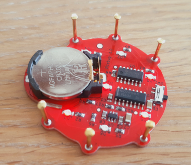

# The DiceBug

*by Till Straumann, 2023*

## Introduction

This is a simple electronics project that I have created to
teach kids how electronic circuits are "built" -- in a physical
sense. They don't have to understand how it works (6 year olds
have assembled the bug) but just have fun placing the small
components on the board, watch the solder melt in the toaster
oven and walk away with the finished product.

 

The cute bug features a motion sensor and operates as an "electronic
dice" cycling throught the familiar patterns of pips we know from
traditional dice. The cycling is randomly triggered by hand motion
and happens too fast to control the outcome. When the hand is withdrawn
the bug will show a random facet.

The bug's preferred meal is a CR2032 lithium battery. A small power-switch
is located at the tail end of the animal.

Occasionally, the motion sensor may have to recalibrate itself
(the dice seems to be "stuck" when that happens). Just leave it alone
for several seconds (no touching) and it will come back to life.

Since the battery is exposed don't store the or operate the device
in a conducting bag or box.

## Warning

*Keep (any type of) batteries away from small children. Swallowing
batteries can be life-threatening!*

## Assembly Instructions

### Prerequisites

#### PCB

You need to have the PCB manufactured. There are many companies (mostly
in China) who do this cheaply. I found, however, that most manufacturers
would not offer the red solder mask combined with black ink (silkscreen)
that I liked. Eventually, I came across [elecrow](https://www.elecrow.com)
who would make the PCBs they way I wanted them (slightly more
expensive "premium service").

Make sure to also order a couple of stainless steel stencils
(more than one if you work with groups of kids). PCB manufacturers often
also offer stencils and you save on shipping cost when ordering from a
single source...

#### Parts

The parts can be obtained from standard electronics distributors
(DigiKey, Mouser, Farnell).

For the feet I use brass-plated nails, 1.2mm (dia) x 12mm (length).

You'll also need solder paste (I had good results with lead-free low-temperature
paste, Chipquik TS391LT50, which melts aroung 138degC).

For the actual soldering you'll need a cheap toster oven or a hotplate,
YMMV. There are many instructions available on the internet.

#### IQS211 Capacitive Sensor Programming

This IC is very versatile and ideal for this kind of application.
I have regularly found it at Mouser; DigiKey sometimes don't have them.

Note that you need to configure ("burn") the IQS211's OTP options prior
to using it in your application. Unfortunately, this means that you need
the Azoteq CT210 Programmer (also available from distributors) and a
programming socket (e.g., [here](https://git@github.com/till-s/kicad-sot23-prog.git)).

The configuration value is stated in the schematics.

### Assembly

Nothing special here; I have a bunch of tweezers that I lend the
kids so they can work in parallel. Usually a kid's eyesight is
good enough to see the 805 parts perfectly. Adults may need glasses.

Spend some time on the internet if you have never done this; there
are many resources available.

Obvously, you only install the battery into the holder after soldering
the board.

#### Feet

After assembling and soldering/toasting the board I use a small hammer
and carefully hit the small nails just enough so that they hold on
in the mounting holes. Turn the bug on its feet to verify that it stands
nicely tweaking the feet if necessary. Eventually, you use a conventional
soldering iron and (lead-free) solder to fix the feet permanently.

Good luck!
